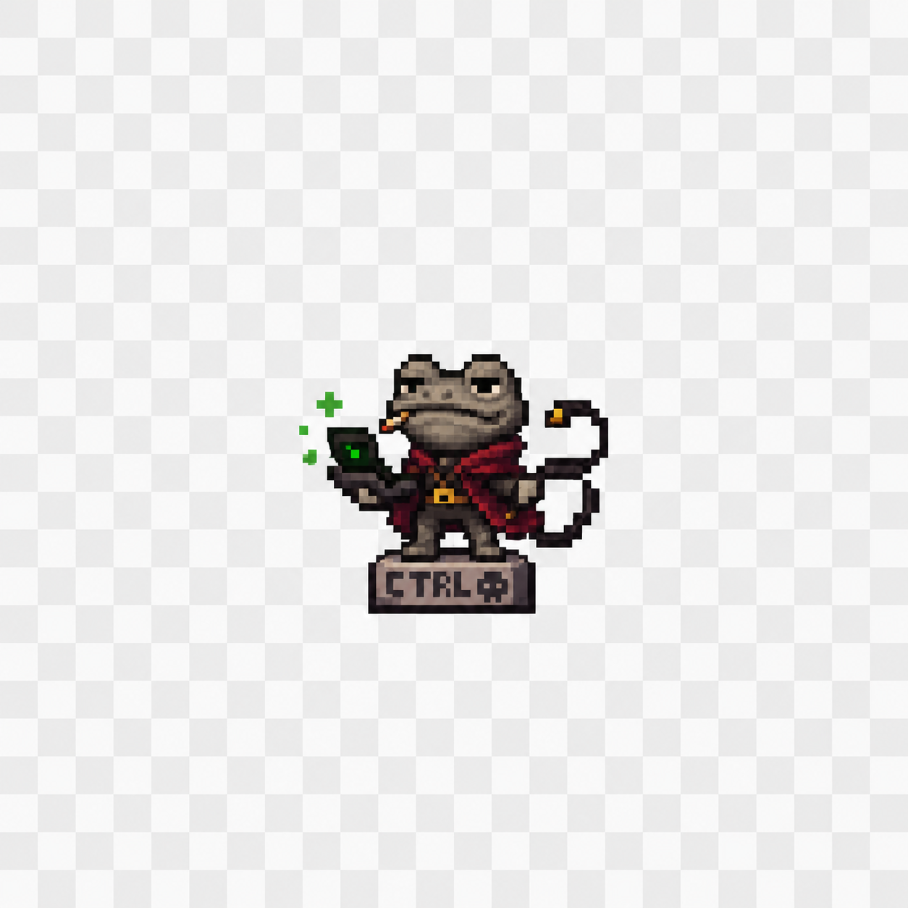
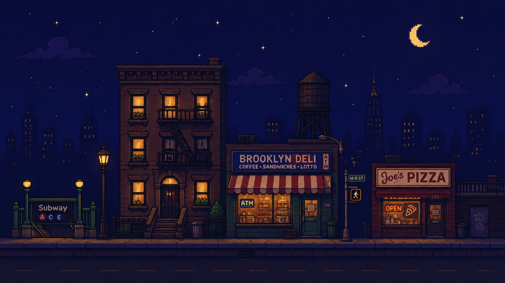

<!-- Retro header -->

<!-- Cute avatar/mascot zone -->

### `now loading... memory card data`

 

<!-- Badges -->

## System Stats

### Languages / Tools I Actually Touch

 
 

 

---

### Thanks for visiting my tiny corner of the internet.

